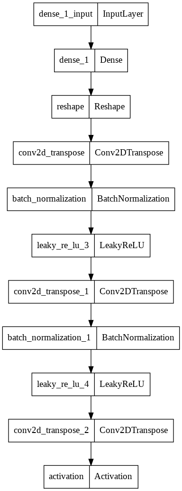
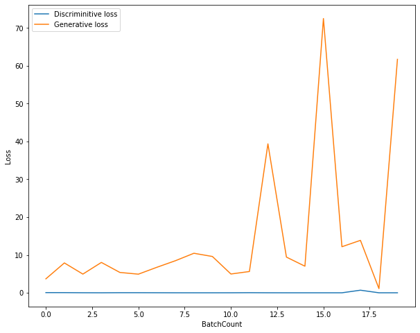
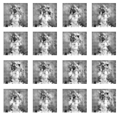
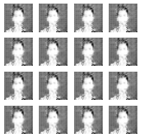
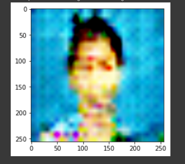

# DCGAN
Montage DCGAN

## Requirements
* tensorflow 2.x
* python 3.x

## Core code
```python
# 생성자 선언
def build_generator(z_dim):

    model = Sequential()
    model.add(Dense(256 * 7 * 7, input_dim=z_dim))
    model.add(Reshape((7, 7, 256)))

    # 7x7x256에서 14x14x128 텐서로 바꾸는 전치 합성곱 층
    model.add(Conv2DTranspose(128, kernel_size=3, strides=2, padding='same'))
    model.add(BatchNormalization())
    model.add(LeakyReLU(alpha=0.01))

    # 14x14x128에서 14x14x64 텐서로 바꾸는 전치 합성곱 층
    model.add(Conv2DTranspose(64, kernel_size=3, strides=1, padding='same'))
    model.add(BatchNormalization())
    model.add(LeakyReLU(alpha=0.01))

    # 14x14x64에서 28x28x3 텐서로 바꾸는 전치 합성곱 층
    model.add(Conv2DTranspose(3, kernel_size=3, strides=2, padding='same'))
    model.add(Activation('tanh'))

    return model
```


## Model



## Training details (epoch < 20000)

### loss



## Results
### epoch=10000


### epoch=20000


### epoch=20000



## Author
SangBeom-Hahn
