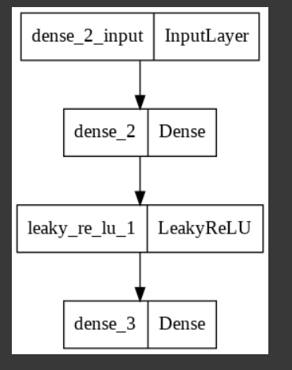

# GAN
Generate Birthday 

## Requirements
* tensorflow 2.x
* python 3.x

## Core code
```python
# 생성자 구현
def build_generator(z_dim):
  model = Sequential()

  model.add(Dense(2, input_dim = z_dim)) # 인풋은 1 다음은 2개의 노드
  model.add(LeakyReLU(alpha = 0.01))
  model.add(Dense(6, activation="sigmoid")) # 2개의 노드 다음은 6개의 노드

  return model
  
  
# 생일 데이터 셋 준비 (= (X_train, _), (_, _) = mnist.load_data() )
X_train = []

for i in range(10000):
  X = [np.random.uniform(8.8, 9.2), np.random.uniform(8.8, 9.2), np.random.uniform(0.0, 0.2), np.random.uniform(8.8, 9.2), np.random.uniform(0.8, 1.2), np.random.uniform(6.8, 7.2)]
  X_train.append(X)

X_train = np.array(X_train)
```


## Model



## Results
### generate my birthday 99.09.17


## Author
SangBeom-Hahn
